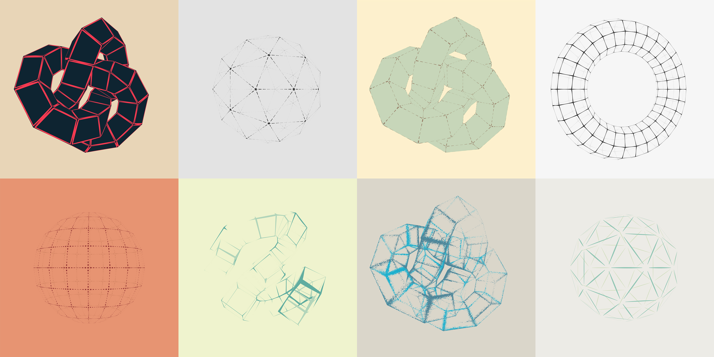
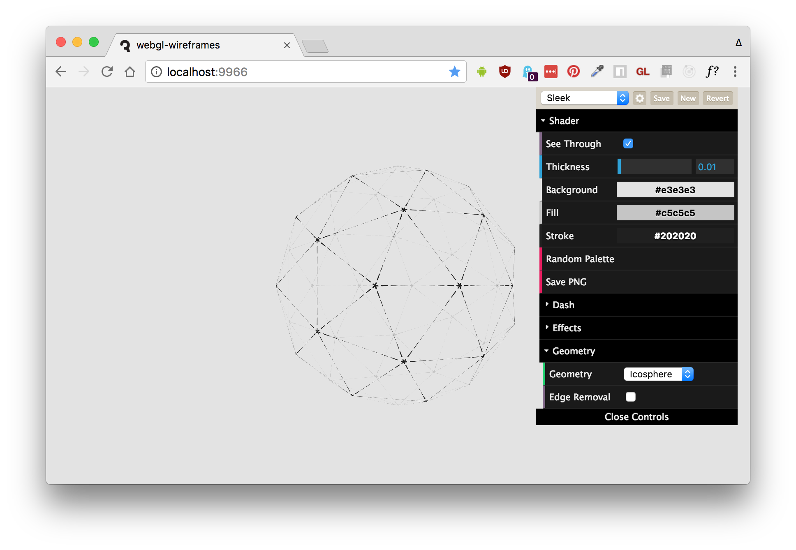

# webgl-wireframes



This is the code for a November 2017 net magazine tutorial, _Stylized Wireframe Rendering in WebGL_. Check out the article (when it's released) for more details.

## Stylized Wireframe Rendering in WebGL

The code here uses barycentric coordinates to create stylized wireframes in ThreeJS and WebGL. Some features of the code and its shaders include:

- Alpha to Coverage for crisp alpha cutouts and depth testing with Multisample Anti-Aliasing
- Thick and anti-aliased single-pass wireframe rendering
- Basic support for animated line dashes
- Inner edge removal to render quads instead of triangles
- A few other effects, such as noise, tapered lines, dual strokes and backface coloring

## Demo

Click [here]() to see a live demo.

[](demo)

## Usage

To build & run this project locally, first clone the repository, then use npm to install and run it:

```sh
npm install
npm start
```

Now open `localhost:9966` to see it in your browser.

To build:

```sh
npm run build
```

## License

MIT, see [LICENSE.md](http://github.com/mattdesl/webgl-wireframes/blob/master/LICENSE.md) for details.
